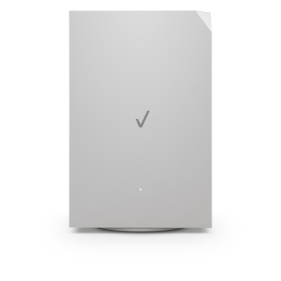

# Verizon 5G Gateway for Home Assistant



Local monitoring for the **Askey ASK-NCM1100 Verizon 5G gateway**. No cloud account, MQTT broker, or separate polling service required.

Version **0.1.1**. Requires **Home Assistant 2026.9.0 or later**. Community project, not affiliated with or endorsed by Verizon or Askey.

## Supported hardware

Live telemetry has been confirmed with **ASK-NCM1100**, firmware **3.6.0.5**, on **Home Assistant 2026.9.2**. Other models, including ASK-NCM1100E and its business dual-WAN mode, are not supported. Session-expiry and error recovery have automated simulated-gateway coverage; extended real-device soak testing is still ongoing.

## Install with HACS

1. Open **HACS**, then its menu and **Custom repositories**.
2. Add `https://github.com/BluThunder2k/ha-verizon-5g` with type **Integration**.
3. Find **Verizon 5G Gateway**, download it, and restart **Home Assistant Core**.
4. Go to **Settings → Devices & services → Add integration → Verizon 5G Gateway**.
5. Enter your gateway management host, admin password, and preferred polling interval (default 60 seconds).

This project is prepared for installation as a HACS custom repository. It is not included in HACS's default catalog.

### Existing manual installations

Back up your Home Assistant configuration, add this repository to HACS, and download it. HACS manages the same `custom_components/verizon_5g` directory. Restart Home Assistant; keep the existing integration entry. The integration domain and entity unique IDs are unchanged, so there is no need to delete or re-add the device.

## Manual installation

1. Download the repository ZIP and extract it on your computer.
2. Copy the entire `custom_components/verizon_5g` folder into your Home Assistant configuration folder's `custom_components` directory. Create `custom_components` if needed.
3. Confirm this exact file exists: `/config/custom_components/verizon_5g/manifest.json`. Avoid an extra nested `verizon_5g` folder.
4. Restart **Home Assistant Core**.
5. Open **Settings → Devices & services → Add integration** and search for **Verizon 5G Gateway**.
6. Enter:
   - Device name: **Verizon Backup** (or your preferred name)
   - Gateway host: **your gateway management hostname or IP address**
   - Gateway admin password: enter locally in Home Assistant
   - Polling interval: **60** seconds
   - Verify HTTPS certificate: **off** for the gateway's factory self-signed certificate

There is no configuration.yaml entry, MQTT broker, separate service, or cloud login to configure. Home Assistant itself must have a route to the gateway's management address. Desktop access alone does not prove HA can reach it. Certificate verification, when disabled, is scoped to this gateway client's requests.

## Entities

The default name normally produces the entity IDs below; Home Assistant can append suffixes if an ID already exists. Rename entities as needed in the UI.

| Default entity | Meaning |
| --- | --- |
| `sensor.verizon_backup_ipv4_status` | Connected, Connecting..., Disconnected, or Disabled, following the gateway's web UI logic |
| `binary_sensor.verizon_backup_ipv4_connected` | On only when the gateway UI calculation reports Connected |
| `sensor.verizon_backup_wan_ipv4` | Modem-reported WAN IPv4 address |
| `sensor.verizon_backup_cellular_technology` | Raw network type such as 5G |
| `sensor.verizon_backup_5g_signal_strength` | Raw numeric value labeled “5G Signal Strength” by the gateway |
| `sensor.verizon_backup_sim_status` | Ready, Absent, PIN Required, PUK Required, or Unknown |
| `sensor.verizon_backup_firmware` | Gateway firmware |
| `sensor.verizon_backup_uptime` | Router uptime in seconds, displayed as a duration by HA |

Additional entities are created disabled by default: 4G LTE signal strength, WAN IPv6, WAN type, modem firmware, LED status, and roaming status. Enable any you want from the device's entity list.

Signal units and the precise radio metric (RSRP versus RSSI) remain unverified. Accordingly, the integration does not assign dBm, signal thresholds, or a signal-strength device class. Numeric history and measurement statistics are available. A zero, blank, non-finite, or placeholder signal becomes unknown; zero does not produce a spurious excellent-signal point.

The connected entity matches **gateway-reported IPv4 status**, not an Internet ping test. Keep any existing Verizon-specific routed reachability probe as a separate check. A gateway that cannot be polled makes all entities **unavailable**, rather than inventing a Disconnected reading or retaining stale readings as available.

## Status calculation

For ASK-NCM1100's normal cellular mode:

1. `wan_disable == "1"` or `modem_wan_enable == "0"` gives Disabled.
2. Otherwise, `wan_state != "WANDOWN"` and `wan_dhcp4_addr` not equal to `""`, `"0.0.0.0"`, or `"-"` gives Connected.
3. Otherwise, a physical Ethernet/Coax WAN link of Up, or either `cellur_wan_ipv4` or `cellur_wan_ipv6` equal to `"1"`, gives Connecting....
4. Otherwise the result is Disconnected.

These rules were traced from the gateway status-page JavaScript. A stale assigned address cannot override WANDOWN. The gateway also has other modes: the ASK-NCM1100E/business dual-WAN mode is deliberately not supported by this release.

## Sessions, credentials, and privacy

- Authenticates with a fresh local challenge, then reuses an in-memory session cookie.
- Username: `SHA512(MD5("admin"))`; password response: `SHA512(token + SHA512(MD5(password)))`, using the firmware's low-byte UTF-16 MD5 input encoding and lowercase hexadecimal outputs.
- Polls `cgi_basic.js` and `cgi_status.js` once per update. Basic provides enable settings that may be omitted or commented out in the status response. All sensors share the same update.
- Detects session expiry, including HTTP 200 with unauthenticated JSON, and permits one login recovery per update.
- Rejected authentication stops subsequent automatic login attempts and asks Home Assistant to reauthenticate. Temporary lockout/session exhaustion respects a cooldown of at least five minutes, or the reported timeout if longer.
- Best-effort logout on configuration validation completion, integration unload, or Home Assistant shutdown. A network outage can prevent logout; that session will expire normally.
- The admin password is stored in HA's config-entry storage, as with other password-based integrations. Protect HA backups accordingly. Tokens and cookies are memory-only and are never logged or sent to another service.
- Does not expose phone number, IMEI, ICCID, serial number, Wi-Fi configuration, or LAN client inventory. The gateway MAC is used locally as a stable device identifier. WAN IP entities are stored in HA history by default; exclude those entities from Recorder if you do not want IP history.
- Only login/logout requests and read operations are implemented. There are no reboot, firmware-update, or gateway-setting controls.

## Change settings or remove

Use the integration entry's three-dot menu → **Reconfigure** to change the name, address, password, polling interval, or certificate setting. The form asks for the password again and tests the connection before saving. Reconfiguring the display name does not necessarily rename existing entity IDs.

For a changed password, the integration offers a reauthentication flow. If the gateway reports a lockout, wait for it to clear before submitting the form again.

To remove: delete the integration entry in Devices & services, then optionally remove `/config/custom_components/verizon_5g` and restart HA.

## Validation and limits

- The underlying login formula and telemetry retrieval were confirmed by a live PowerShell test against ASK-NCM1100 firmware **3.6.0.5**.
- This Python client passed 13 offline tests, including a local simulated HTTP gateway with real cookie handling: authentication, repeated polling/session reuse, expiry recovery, wrong-password suppression, lockout cooldown, network failure recovery, and concurrent polling.
- Parser tests cover UI status transitions, stale IP with WANDOWN, invalid readings, missing fields, unsupported models, commented-out settings, and non-execution of JavaScript input.
- Live Home Assistant installation confirmed authentication, telemetry, entity creation, and the local integration icon. Extended real-device session renewal and outage testing remain ongoing.
- Firmware changes may change these private endpoints. This release supports the consumer ASK-NCM1100 only.

The included tests require Python 3.12+ and aiohttp; run `python -m unittest discover -s tests -v` from the extracted package. No Home Assistant installation is needed for these protocol tests.

Home Assistant implementation references: [config flows](https://developers.home-assistant.io/docs/core/integration/config_flow/), [coordinated polling](https://developers.home-assistant.io/docs/integration_fetching_data/), and [setup failures](https://developers.home-assistant.io/docs/integration_setup_failures/). Device reference: [Verizon ASK-NCM1100 support](https://www.verizon.com/support/verizon-internet-gateway-ask-ncm1100/).

## Brand icon

The integration includes local light- and dark-theme icons in `custom_components/verizon_5g/brand/`. Restart Home Assistant after installing and refresh the browser if the old placeholder remains cached.

## Reporting problems

Open an issue with your gateway model, firmware, Home Assistant version, integration version, and a description of the problem. Do not post raw gateway responses, HAR files, configuration backups, passwords, password hashes, authentication tokens, cookies, IP addresses, MAC addresses, serial numbers, phone numbers, IMEI, or ICCID. Report a different model before attempting to adapt its authentication flow.

## Development

```sh
python -m pip install -r requirements-test.txt
python -m unittest discover -s tests -v
```

All committed protocol fixtures are synthetic. The repository contains no live gateway captures or user credentials. Authentication hashes are calculated at runtime, not copied from browser sessions.

Code is licensed under the MIT License. See [LICENSE](LICENSE). Verizon and Askey names and marks belong to their respective owners; the bundled device image is used for identification and is not covered by the code license.
